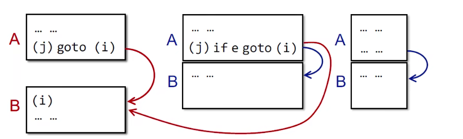
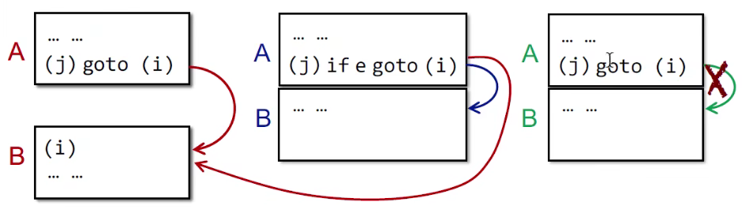
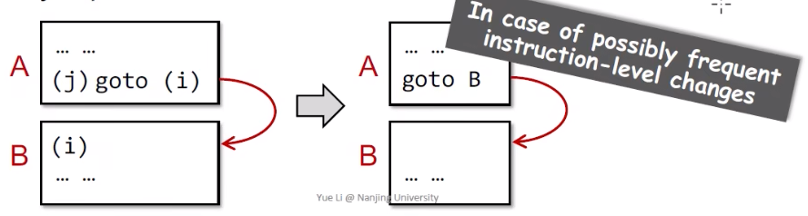
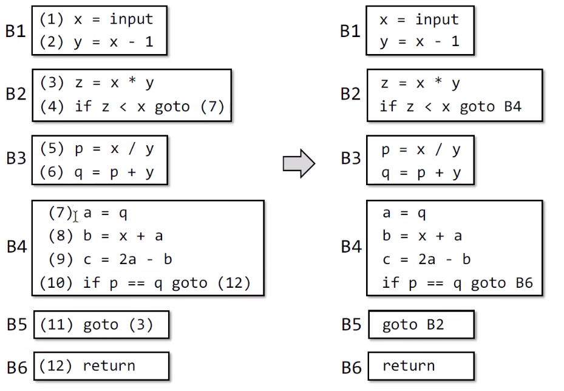
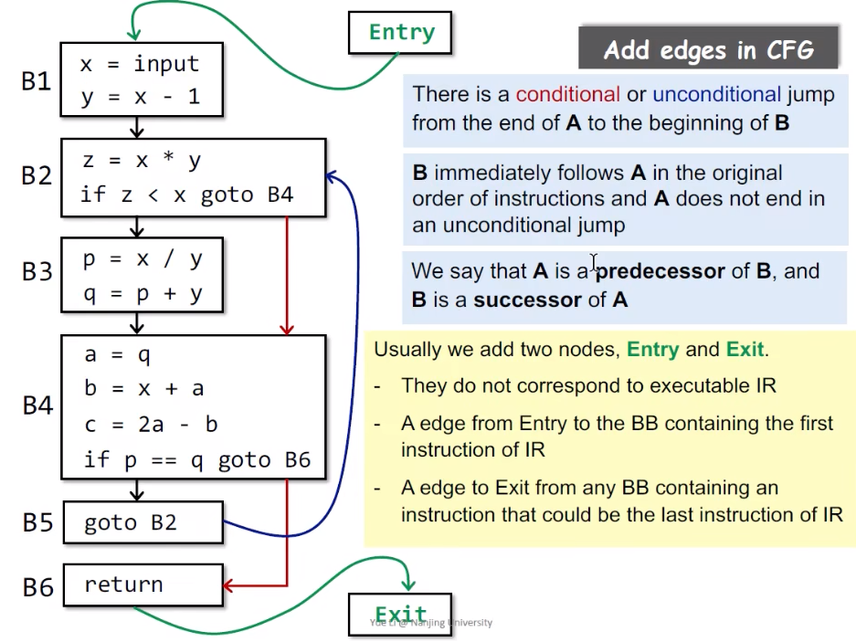

# Intermediate Representation

## Compilers and Static Analyzers

source code=>词汇=>语法=>语义=>IR


## AST vs. IR

- AST
  - high=level and closed to grammar structure
  - usually language dependent 
  - suitable for fast type checking
  - lack of control flow information
- IR
  - low-level and closed to machine code
  - usually language independent
  - compact and uniform
  - contains control flow information
  - usually considered as the basis for static analysis


## Three-Address Code(3AC)

There is at most one operator on the right side of an instruction.

```
t2 = a + b + 3
===>
	t1 = a + b
	t2 = T1 + 3
```

> Why called 3-address?
>
> Address can be one of the following:
>
> - Name: a, b
> - Constant: 3
> - Compiler-generated temporary: t1, t2
>
> Each type of instructions has its own 3AC form

Some Common 3AC Forms

- x = y bop z
- x  = uop y
- x = y
- goto L
- if x goto L
- if x rop y goto L


## 3AC in Real Static Analyzer: Soot

Soot and Its IR: Jimple

- Soot
  - Most popular static analysis framework for Java
    - https://github.com/Sable/soot
    - https://githubj.com/Sable/soot/wiki/Tutorials
  - Soot's IR is Jimple: typed 3-address code

### example1

下面是一个Java的For循环源代码：

```java
package nju.sa.examples;
public class ForLoop3AC {
    public static void main(String[] args) {
        int x = 0;
        for(int i = 0; i < 10; i++) {
            x = x + 1;
        }
    }
}
```

这是它的3AC(Jimple):

> x 被Soot优化掉了，是为啥被优化掉我们不做讨论

```java
public static void main(java.lang.String[]){
    java.lang.String[] r0;
    int i1;
    
    r0 := @parameter0: java.lang.String[];
    
    i1 = 0;
    
  label1:
    if i1 >= 10 goto label2;
    
    i1 = i1 + 1;
    
    goto label1;
  
  label2:
    return;
}
```

### example2

下面是一个Java的Do-Whole循环源代码：

```java
package nju.sa.examples;
public class DoWhileLoop3AC {
    public static void main(String[] args) {
        int[] arr = new int[10];
        int i = 0;
        do {
            i = i + 1
        } while(arr[i] < 10);
    }
}
```

这是它的3AC(Jimple):

> 一般情况下，变量前面加$符号，说明它是一个临时变量

```java
public static boid main(java.lang.String[]) {
    java.lang.String[] r0;
    int[] r1;
    int $i0, i1;
    
    r0 := @parameter0: java.lang.String[];
    
    r1 = newarray (int)[10];
    
    i1 = 0;
  
  label1:
    i1 = i1 + 1;
    
    $i0 = r1[i1];
    
    if $i0 < 10 goto label1;
    
    return;
}
```

### example3

> 前置知识：
>
> invokespecial: call constructor, call superclasss methods, call private methods
>
> invokeviruutal: instance methods cacll(virtual dispatch)
>
> invokeinterface: cannot optimization, checking interface implementation
>
> invokestatic: call static methods
>
> Java 7: invokedynamic => Java static typing, dynamic language runs on JVM
>
> method Signature: class name: return type method name(parameter1 type, parameter2 type)
>
> 
>
> PS：new一个类出来，其实也就是调用了该类的构造函数

下面是一个Java的Method Call源代码：

```java
package nju.sa.examples;
public class MethodCall3AC {
    
    String foo(String para1, String para2) {
        return para1 + " " + para2;
    }
    
    public static void main(String[] args) {
        MethodCall3AC mc = new MethodCall3AC();
        String result = mc.foo("hello", "world");
    }
}
```

这是它的3AC(Jimple):

```java
java.lang.String foo(java.lang.String, java.lang.String) {
    nju.sa.examples.Method3Ac r0;
    java.lang.String r1, r2, $r7;
    java.lang.StringBuilder $r3, $r4, $r5, $r6;
    
    r0 := @this: nju.sa.examples.MethodCall3AC;
    r1 := @parameter0: java.lang.String;
    r2 := @parameter1: java.lang.String;
    $r3 = new java.lang.StringBuilder;
    specialinvoke $r3.<java.lang.StringBuilder: void <init>()>();
    $r4 = virtualinvoke $r3.<java.lang.StringBuilder: java.lang.StringBuilder append(java.lang.String)>(r1);
    $r5 = virtualinvoke $r4.<java.lang.StringBuilder: java.lang.StringBuilder append(java.lang.String)>(" ");
    $r6 = virtualinvoke $r5.<java.lang.StringBuilder: java.lang.StringBuilder append(java.lang.String)>(r2);
    $r7 = virtualinvoke $r6.<java.lang.StringBuilder: java.lang.String toString()>();
    return $r7;
} 
```

### example4

下面是一个Java的Main源代码：

```java
package nju.sa.examples;
public class MethodCall3AC {
    String foo(String para1, String para2) {
        return para1 + " " + para2;
    }
    
    public static void main(String[] args) {
        MethodCall3AC mc = new MethodCall3AC();
        String result = mc.foo("hello","world");
    }
}
```

这是它的3AC(Jimple):

```java
publicc static void main(java.lang.String[]) {
    java.lang.String[] r0;
    nju.sa.examples.MethodCall3AC $r3;
    
    r0 := @parameter0: java.lang.String[];
    $r3 = new nju.sa.examples.MethodCall3AC;
    
    specialinvoke $r3.<nju.sa.examples.MethodCall3AC: void <init>()>();
    
    virtualinvoke $r3.<nju.sa.examples.MethodCall3AC:
    	java.lang.String foo(java.lang.String,java.lang.String)>("hello","world");
    return;
}
```

### example5

下面是一个Java的Class源代码：

```java
package nju.sa.examples;
public class Class3AC {
    public static final double pi = 3.14;
    public static void main(String[] args) {
        
    }
}
```

这是它的3AC(Jimple):

```java
public class nju.sa.examples.Class3AC extends java.lang.Object {
    public static final double pi;
    
    public void <init>() {
        nju.sa.examples.Class3AC r0;
        r0 := @this: nju.sa.examples.Class3AV;
        specialinvoke r0.<java.lang.Object: void <init>()>();
        return;
    }
    
    public static void main(java.lang.String[]) {
        java.lang.String[] r0;
        r0 := @parameter0: java.lang.String[];
        return;
    }
    
    public static void <clinit>() { // 一个类的静态的初始化函数
        <nju.sa.examples.Class3AC: double pi> = 3.14;
        return;
    }
}
```

## *Static Single Assignment(SSA)

### brief

- All assignments in SSA are to variables with distinct names
  - Give each definitiono a fresh name
  - Propagate fresh name to subsequent uses
  - Every variable has exactly one definition


How to understand "Every variable has exactly one definition"? What if a valiable use is at control flow merges?


### Why SSA?

- Flow information is indirectly incorporated into the unique variable names
  - May help diliver some simpler analyses, e.g., flow-insensitive analysis gains partial precisioon of flow-sensitive analysis via SSA
- Define-and-Use pairs are explicit
  - Enable more effective data facts storage and propagation in some on-demand tasks
  - Some optimization tasks perform better on SSA(e.g., conditional constant propagation, global value numbering)

### Why not SSA?

- SSA may introduce too many variables and phi-functions
- May introduce inefficiency problem when translating to machine code(due to copy operations)


## Control Flow Graphs(CFG)

### Brief

- Usually refer to building COntrol Flow Graph(CFG)
- CFG serves as the basic struccture for static analysis
- The node in CFG can be an individual 3-address instruction, or(usually) a Basic Block(BB)


### Basic Blocks(BB)

- Basic blocks(BB) are maximal sequences of consecutive three-address instructions with the properties that
  - It can be entered only at the beggining, i.e., the first instruction in the block
  - It can be exited only at the end, i.e., the last instruction in the block 


How to build Basic Blocks?

- **INPUT**: A sequence of three-address instructions of P
- **OUTPUT**: A list of basic blocks of P
- **METHOD**:
  1. Determine the leaders in P
     - The first instruction in P is a leader
     - Any target instructon of a conditional or unconditional jump is a leader
     - Any instruction that immediately follows a conditional or unconditional jump is a leader
  2. Build BBs for P
     - A BB consists of a leader and all its subsequent instructions until the next leader

For instance:


### How to build CFG on top of BBs?

- The nodes of CFG are basic blocks
- There is an edge form block A to block B if and only if
  - There is a conditional or unconditional jump from the end of A to the beginning of B
  - B immediately follows A in the original order of instructions and A does not end in an unconditional jump. As the pics: 
  - 
  - 

- It is normal to replace the jumps to instrucion labels by jumps to basic blocks






Add edges in CFG




