# Data Flow Analysis 1: Applications

## Brief 

Safe-approximation: may analysis: safe=over, must analysis: safe=under.


## Preliminaries of Data Flow Analysis

- Each execution of an IR statement transforms an input state to a new output state.
- The input (output) state is associated with the program point(after) the statement.

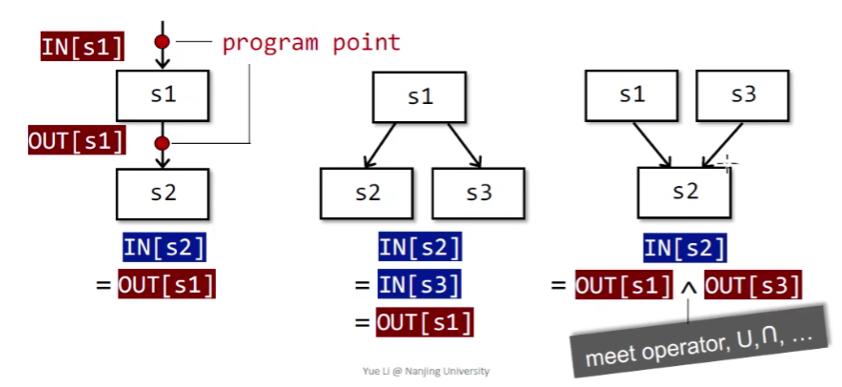

In each data-flow analysis application, we associate with every program point a data-flow value that represents an abstraction of the set of all possible program states that can be observed for that point.

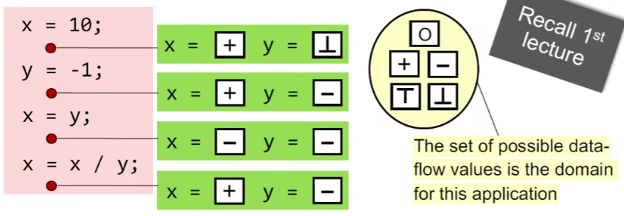

Data-flow analysis is to find a solution to a set of safe-approximation-directed constraints on the IN[s]'s and OUT[s]'s, for all statements s.

- constraints based on semantics of statements(transfer functions)
- constraints based on the flows of control

### Notations for Transfer Function's Constraints

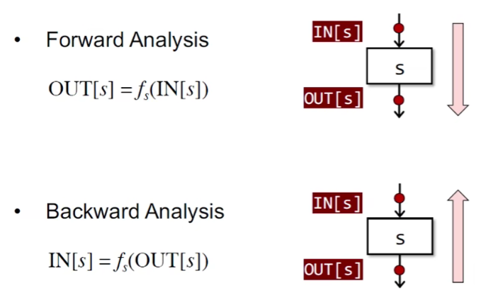

### Notations for Control Flow's Constraints

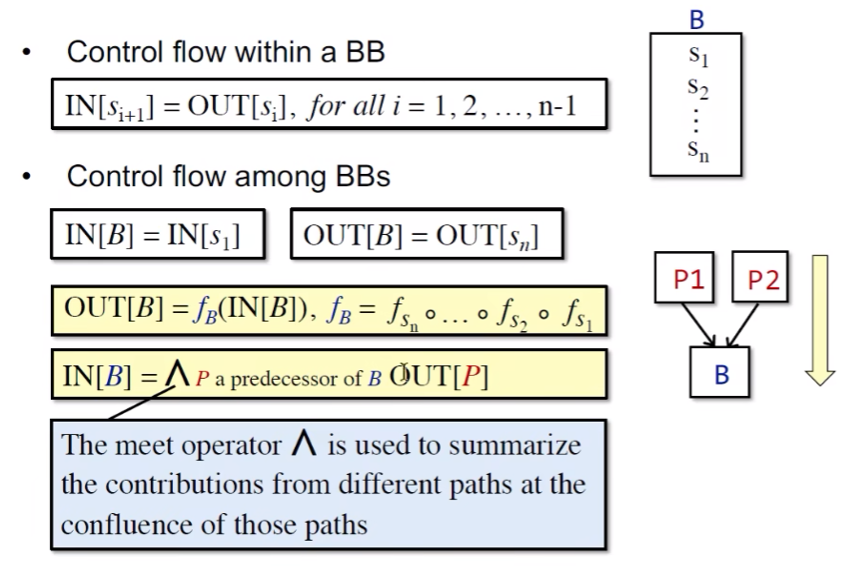

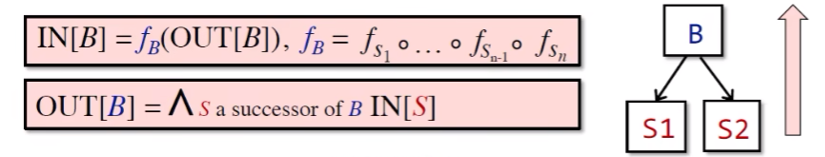

## (1)Reaching Definitions Analysis

Issues Not Covered

下面的内容仅仅只是在同一个函数内部、变量没有别名

### Reaching Definitions

A definition d at program point p reaches a point q if there is a path from p to q such that d is not "killed" along that path

- A definition of a variable v is a statement that assigns a value to v.
- Translated as: definition of variable v at program point p reaches point q if there is a path from p to q such that no new definition of v appears on that path.


- Reaching definitions can be used to detect possible undefined variables. e.g., introduce a dummy definition for each variable v at the entry of CFG, and if the dummy definition of v reaches a point p where v is used, then v may be used before definition(as undefined reaches v).

### Understanding Reaching Definitions

- Data Flow Values/Facts
  - The definitions of all the variables in a program
  - Can be represented by bit vectors:

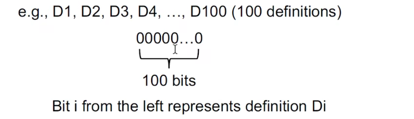

For Safe-approximation:

```
D: v = x op y
```

 This statement "generates" a definition D of variable v and "kills" all the other definitions in the program that define variable v, while leaving the remaining incoming definitions unaffected.

- Transfer Function


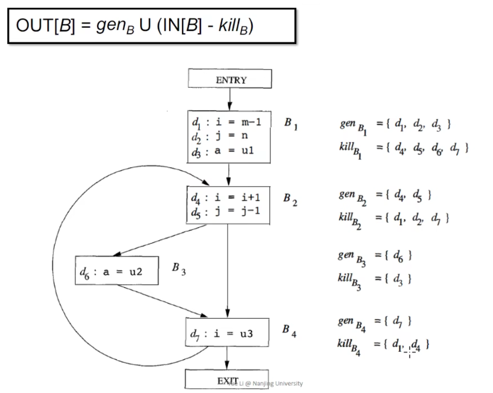

- Control Flow

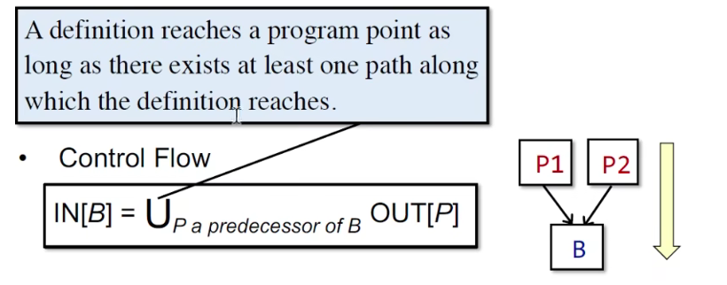

Algorithm of Reaching Definitions Analysis

> 细节1：OUT[entry] = Ø。回答：因为在本处entry是没有statement的，因此输出的时候也应该没有包含entry的东西
>
> 细节2：为什么each basic block B\entry?即为啥要去除entry。直接将\entry和OUT[entry] = Ø删除了效果不是一样吗？这样就多此一举了。回答：这是模板的需求，因为在不同的模式下，entry可能会初始化不同的内容，不一定为空
>
> 细节3：为啥OUT[B] = Ø？回答：先这么记着，may analysis一般都为Ø，must analysis一般都为top
>
> 细节4：changes to any OUT occur你能保证这个算法一定能停下来？回答：因为IN[B]和OUT[B]的元素数量是非严格递增且有上界，所以极限存在，会收敛。

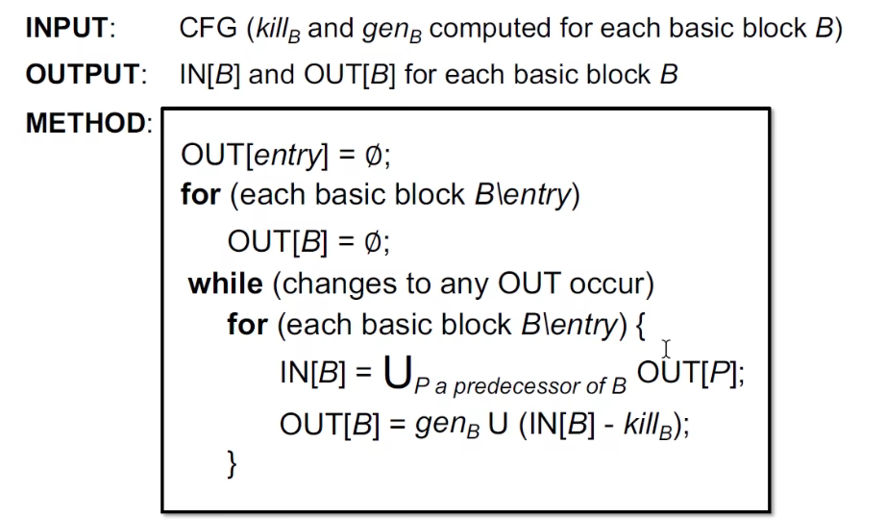

For instance：

1.整体

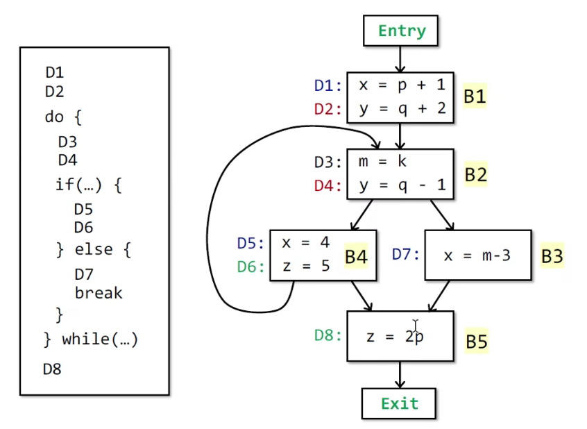

2.初始化为空

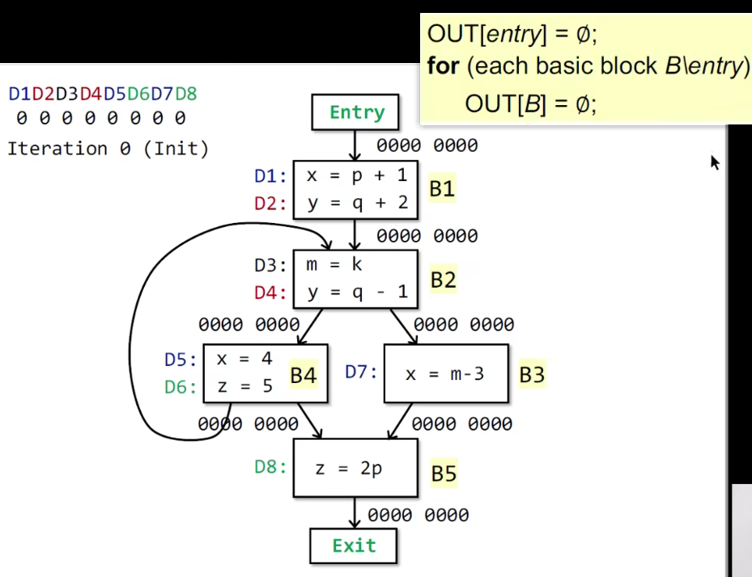

3.Iteration 1

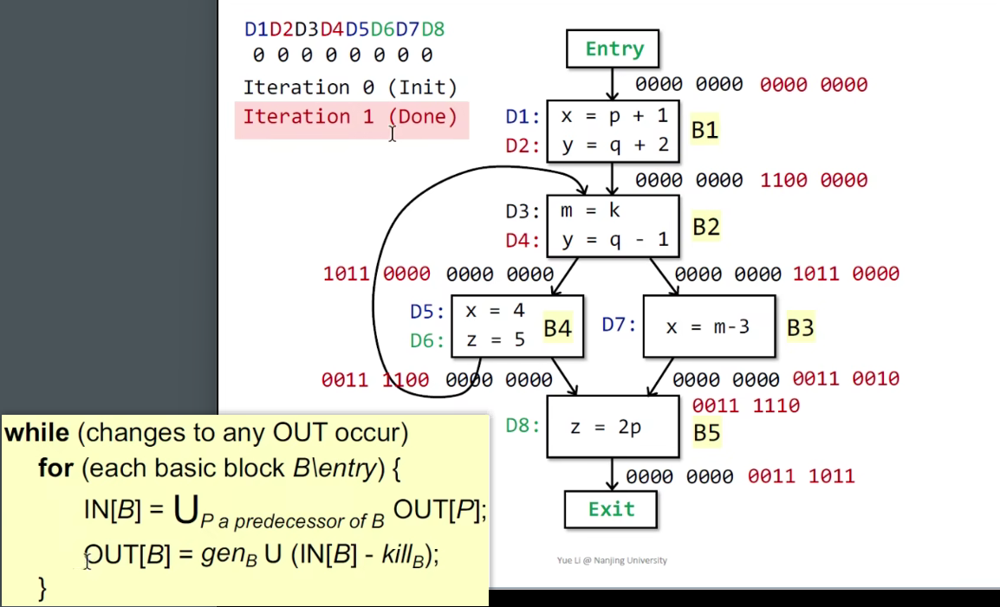

4.Iteration 2：因为OUT有变化，因此需要再次迭代

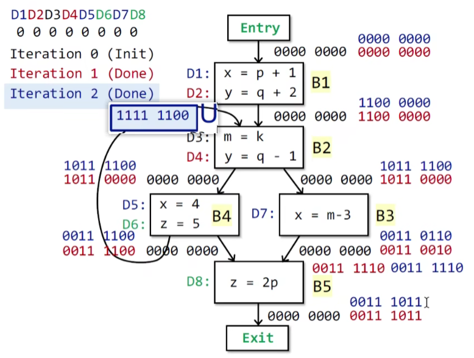

5.Iteration 3: 因为中间的BB的state有变化

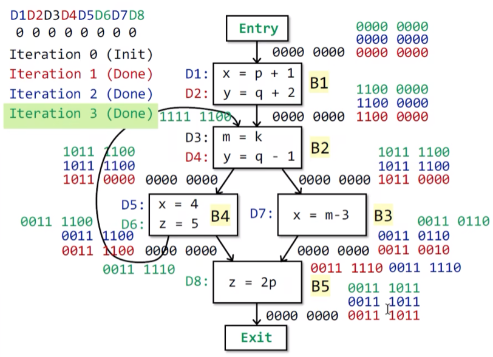

> 同时可以得出：BB的输入不变，输出就不会变

6.结束：没有BB的状态发生变化


7.同时可以回顾到以前的知识：

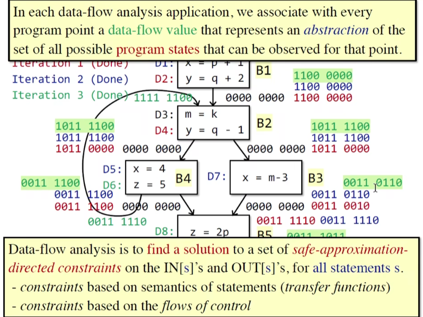

8.之前问的Why this iterative algorithm can finally stop就有直觉感受到答案了。我们接下来详细来分析一下原因：

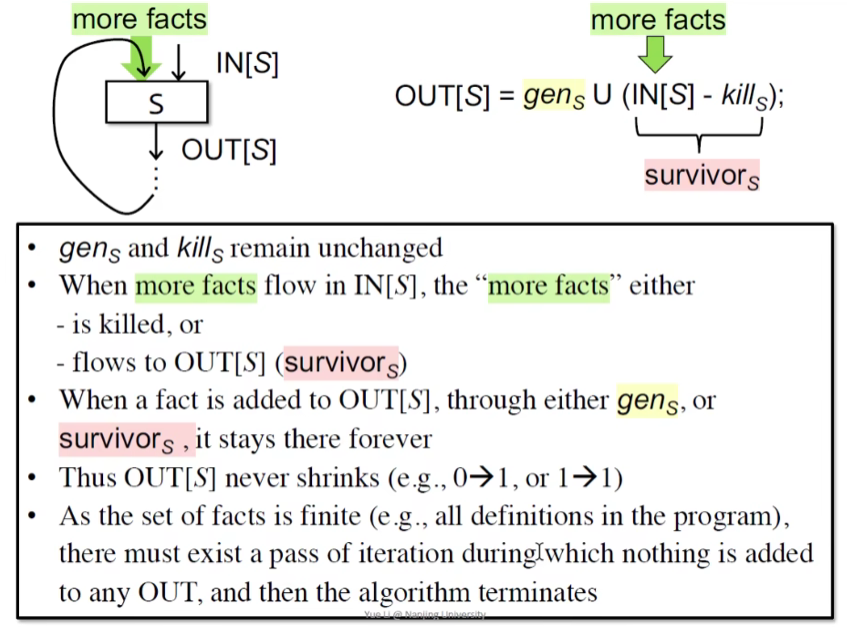

9.总结

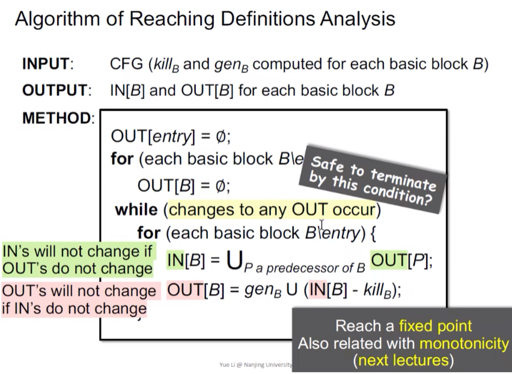


