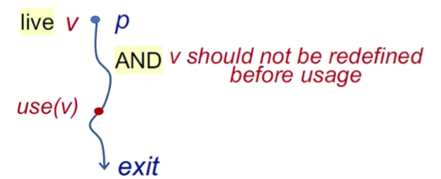
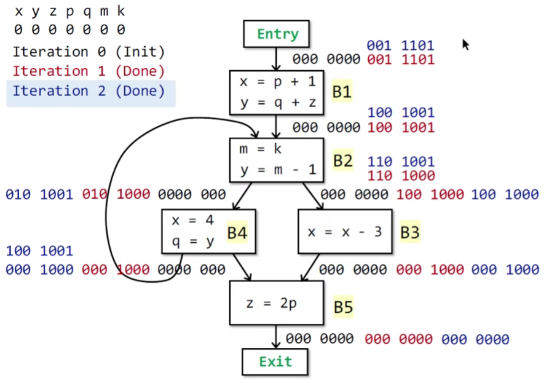

# Data Flow Analysis 2: Applications

## (2)Live Variables

### Brief

Live variables analysis tells whether the value of variable v at program point p could be used along some path in CFG starting at p. If so, v is live at p; otherwise, v is dead at p.

> Information of live variables can be used for register allocations. e.g., at some point all registers are full and we need to use one, then we should favor using a register with a dead value.

### Understanding Live Variables Analysis

Data Flow Values/Facts

- All the variables in a program
- Can be represented by bit vectors

公式

### Algorithm of Live Variables Analysis

example

1：

2：因为IN的state变化了

3：因为B4的状态变化了

4：结束

## (3)Available Expressions Analysis

### Brief

An expression `x op y` is available at program point p if: 

- all paths from the entry to p must pass through the evaluation of x op y, and
- after the last evaluation of x op y, there is no redefinition of x or y

By the way:

- This definition means at program p, we can replace expression x op y by the result of its last evaluation
- The information of available expressions can be used for detecting global common subexpressions before program point p

Understanding Available Expressions Analysis

-  Data Flow Values/Facts
  - All the expressions in a program
  - Can be represented by bit vectors

公式

### Algorithm of Available Expressions Analysis

example

1：初始化

2：发生变化，继续迭代，进入步骤3

3：不再发生state变化

4：结束

## Analysis Comparison

