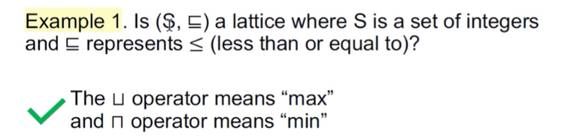

# Data Flow Analysis 3: Foundations

## Iterative Algorithm, Another View

- Given a CFG(program) with k nodes, the iterative algorithm updates OUT[n] for every node n in each iteration.

- Assume the domain of the values in data flow analysis is V, then we can define a k-tuple

  ```
  (OUT[n1], OUT[n2], ..., OUT[nk])
  ```

  as an element of set(V1 * V2 ... * Vk) denoted as V^k, to hold the values of the analysis after each iteration.

- Each iteration can be considered as taking an action to map an element of V^k to a new element of V^k, through applying the transfer functions and control-flow handing, abstracted as a function F: V^k -> V^k
- Then the algorithm outputs a series of k-tuples iteratively until a k-tuple is the same as the last one in two consecutive iterations


X is a fixed point of function F if `X = F(X)`. The iterative algorithm reaches a fixed point.

The iterative algorithm (or the IN/OUT equation system) produces a solution to a data flow analysis.

- Is the algorithm guaranteed to terminate or reach the fixed point, or does it always have a solution?
- If so, is there only one solution or only one fixed point? if more than one, is our solution the best one(most precise)?
- When will the algorithm ranch the fixed point, or when can we get he solution?

To answer these questions, let us learn some math first.

## Partial Order

Brief


example1


example2


example3


example4


## Upper and Lower Bounds

定义1


例子1


定义2


例子2


定义3


一些性质


## Lattice, Semilattice, Complete and Product Lattice

### Lattice

定义


例子1



例子2


例子3


### Semilattice


### Complete Lattice

定义


例子1


例子2


总结

> 是complete lattice不一定是finite lattice。例子：[0,1]中的所有实数


### Product Lattice

定义


## Data Flow Analysis Framework via Lattice

Data flow analysis can be seen as iteratively applying transfer functions and meet/join operations on the values of a lattice.


Review The Questions We Have Seen Before


### Monotonicity and Fixed Point Theorem

规律


证明


Now what we have just seen is the property(fixed point theorem) for the function on a lattice. We can not say our iterative algorithm also has that property unless we can relate the algorithm to the fixed point theorem, if possible.


