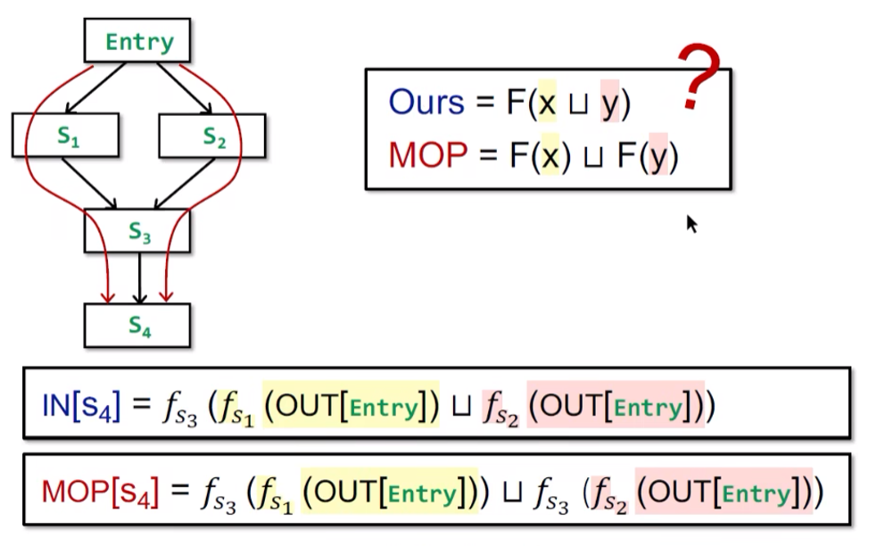
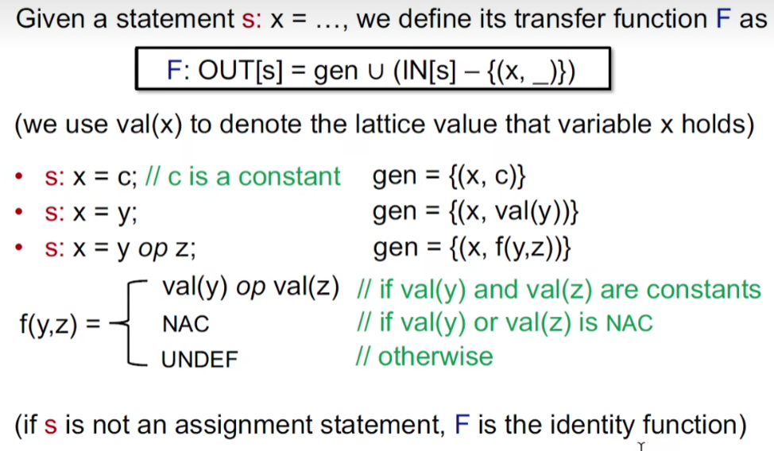

# Data Flow Analysis 4: Foundations

## Relate Iterative Algorithm to Fixed-Point Theorem

### first two

Prove Function F is Monotonic

Thus the fixed point theorem applies to the iterative algorithm for data flow analysis.

### third

When Will the Algorithm Reach the Fixed Point?

## May and Must Analyses, a Lattice View

> 为什么fixed point 一定在safe区了?
>
> 最后提到safe与否，是看transfer function的设计，transfer function设计时应该保证safety。
>
> unsafe point 输入给transfer function，输出肯定会变化（假设设计的transfer function 是safe的），那么unsafe 区就没有不动点。

## How Precise Is Our Solution?

Meet-Over-All-Paths Solution(MOP)

Ours(Iterative Algorithm) vs. MOP

Bit-vector or Gen/Kill problems(set union/intersection for join/meet) are distributive.

## Constant Propagation

### Brief

Given a variable x at program point p, determine whether x is guaranteed to hold a constant value at p.

The OUT of each node in CFG, includes a set of pairs(x, v) where x is a variable and v is the value held by x after that node.

### Lattice

### Transfer Function

### Nondistributivity

## Worklist Algorithm

> an optimization of Iterative Algorithm

