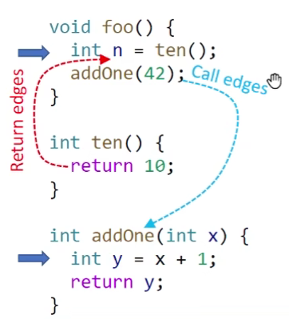
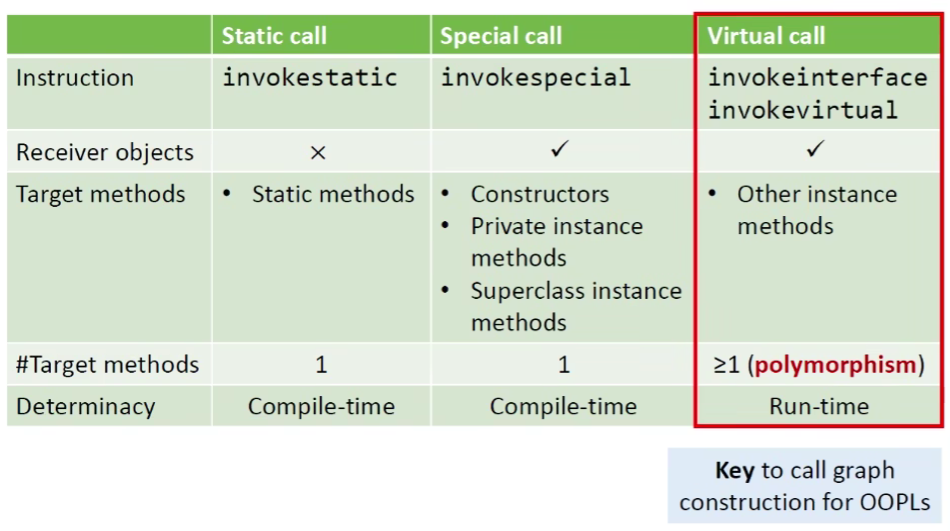

# Interprocedural Analysis

## Motivation

Probelm of Interprocedural Analysis:

Constant Propagation

```java
void foo() {
    int n = ten();
    addOne(42);
}

int ten() {
    return 10;
}

int addOne(int x) {
    int y = x + 1;
    return y;
}
```

So far, all analyses we learned are intraprocedural. How to deal with method calls?

- Make the most conservative assumption for method calls, for safe-approximation
- Source of imprecision

> n = NAC
>
> x = NAC, y = NAC

For better precision, we need Interprocedural analysis:; propagate data-flow information along interprocedural control-flow edges(i.e., call and return edges)

> n = 10
>
> x = 42, y = 43



To perform interprocedural analysis, we need call graph.

## Call Graph

A representation of calling relationships in the program

-  Essentially, a call graph is a set of call edges form call-sites to their target methods(callees)


Call Graph Construction for OOPLs (focus on Java)

- Class hierarchy analysis(CHA)
- Rapid type analysis(RTA)
- Variable type analysis(VTA)
- Pointer analysis(k-CFA)

> 自上而下，精度越高，效率越低；自下而上，精度越低，效率越高

Method Calls (Invocations) in Java



## Method Dispatch of Virtual Calls

理论


例子


## CHA

### Class Hierarchy Analysis*(CHA)

- Require the class hierarchy information(inheritance structure) of the whole program
- Resolve a virtual call based on the declared type of receiver variable of the the call site.


### Call Resolution of CHA

We define function Resolve(cs) to resolve possible target methods of a call site cs by CHA

- static call


- special call: private instance method, Constructor, Superclass instance method


- Virtual call


> 为什么是子集subclass?
>
> 回答：因为dispatch调用B自己的foo会回溯到父类

例子


### Features of CHA

- Advantage: fast
  - only consider the declared type of receiver variable at the call-site, and its inheritance hierarchy.
  - Ignore data and control flow information
- Disadvantage: imprecise
  - Easily introduce spurious target methods
  - Addressed in next lectures

> Common usage: IDE

## Call Graph Construction(CHA)

Build call graph for whole program via CHA

- Start from entry methods(focus on main method)
- For each reachable method m, resolve target methods for each call site cs in m via CHA(Resolve(csc))
- Repeat until no new method is discovered


### Algorithm


例子


## Interprocedural Control-Flow Graph

- CFG represents structure of an individual method
- ICFG represents structure of the whole program
  - With ICFG, we can perform interprocedural analysis

- An ICFG of a program consists of CFGs of the methods in the program, plus tow kinds of additional edges:
  - Call edges: from call sites to the entry nodes of their callees
  - Return edges: from return statements of the callees to the statements following their call sites(i.e., return sites)

```java
void foo() {
    bar(xxx); // call site
    int n = 3; // return site
}
```

ICFG = CFGs + call & return edges

> The information for connecting these two kinds of edges comes from call graph.

例子


## Interprocedural Data-Flow Analysis

### Brief

Analyzing the whole program with method calls based on interprocedural control-flow graph(ICFG)

|                        | Intraprocedural | Interprocedural                   |
| ---------------------- | --------------- | --------------------------------- |
| Program representation | CFG             | ICFG = CFGs + call & return edges |
| Transfer funtions      | Node transfer   | Node transfer + edge transfer     |

Edge transfer

- Call edge transfer: transfer data flow from call node to the entry node of callee(along call edges)
- Return edge transfer: transfer data flow from return node of the callee to the return site(along return edges)

### Interprocedural Constant Propagation

- Call edge transfer: pass argument values
- Return edge transfer: pass return values
- Node transfer: same as intra-procedural constant propagation plus that
  - For each call node, kill data-flow value for the LHS variable. Its value will flow to return site along the return edges

> LHS: left hand side


例子


如果不Kill掉b，会导致丢失精度：


最终


