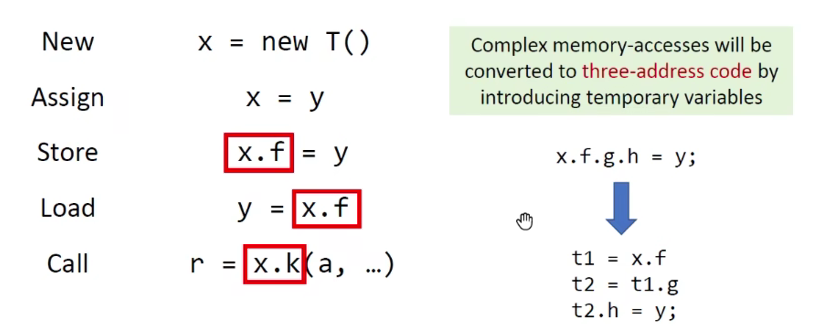

# Pointer Analysis

## Motivation

Problem of CHA


Via Pointer Analysis


## Introduction to Pointer Analysis

### Pointer Analysis

- A fundamental static analysis
  - Computes which memory locations a pointer can point to

- For object-oriented programs(focus on Java)
  - Computes which objects a pointer(variable or field) can point to

- Regarded as a may-analysis
  - Computes an over-approximation of the set of objects that a pointer can point to, i.e., we ask "a pointer may point to which objects?"

> A research area with 40+ years of history
>
> - Wiliam E. Weihl, "Interprocedural Data Flow Analysis in the Presence of Pointers, Procedure Variables, and Label Variables". POPL 1980.
>
> Still an active area today
>
> - OOPSLA'18, FSE'18, TOPLAS'19, OOPSLA'19, TOPLAS'20

### Example


### Pointer Analysis and Alias Analysis

- Two closely related but different concepts
  - Pointer analysis: which objects a pointer can point to?
  - Alias analysis: can two pointers point to the same object?

If two pointers, say p and q, refer to the same object, then p and q are aliases.

```java
p = new c();
q = p;
x = new X();
y = new Y();
```

p and q are aliases. x and y are not aliases.

Alias information can be derived from points-to relations.

### Applications of Pointer Analysis

- Fundamental information: Call graph, aliases, ...
- Compiler optimization: Virtual call inlining, ...
- Bug detection: Null pointer detection
- Security analysis: Information flow analysis
- And many more...

## Key Factors of Pointer Analysis

### Brief

- Pointer analysis is a complex system
- Multiple factors affect the precision and efficiency of the system

> 红色的是本课程选择的研究方向


### Heap abstraction

How to model heap memory?

- In dynamic execution, the number of heap objects can be unbounded due to loops and recursion

```java
for(...) {
	A a = new A();
}
```

- To ensure termination, heap abstraction models dynamically allocated, unbounded concrete objects as finite abstract objects for static analysis.


我们的课程只学习下图中圈主的方向


### Allocation-Site Abstraction

> The most commonly-used heap abstraction

- Model concrete objects by their allocation sites
- One abstract object per allocation site to represent all its allocated concrete objects.


### Context Sensitivity

How to model calling contexts?


### Flow sensitivity

How to model control flow?


### Analysis scope

Which parts of program should be analyzed?


## Concerned Statements

### What Do We Analyze?


Pointers in Java

- **Local variable**: x
- Static field: C.f     [Sometimes referred as global variable]
- **Instance field**: x.f   [Modeled as an object(pointed by x) with a field]
- Array element: array[i]   [Ignore indexes. Modeled as an object(pointed by array) with a single field, say arr, which may point to any value stored in array]


> 学会Instance field其实也就学会了Static field和Array element

规模因此缩小成：Pointer-Affecting Statements：



我们将着重学习Virtual call，因为另外两个比较简单


