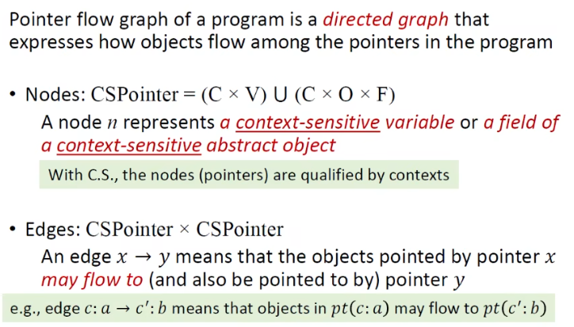
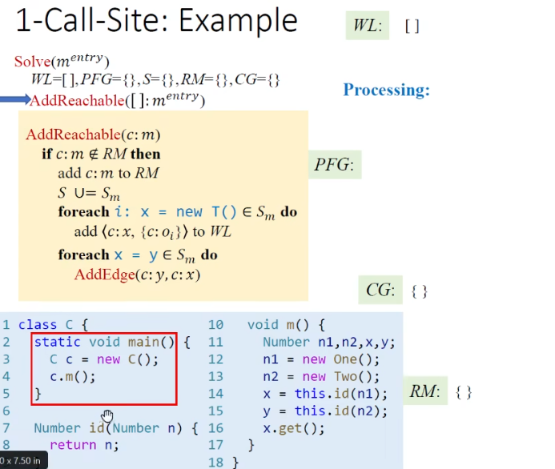
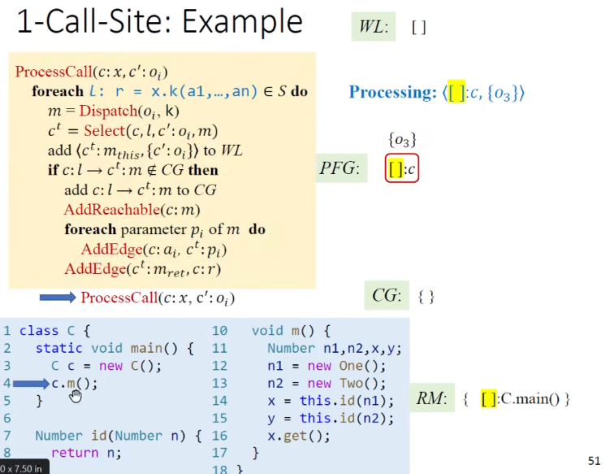

# Pointer Analysis - Context Sensitivity

## Problem of Context-Insensitive Pointer Analysis

Via Context-Sensitive Pointer Analysis

## Introduction

### Imprecision of Context Insensitivity(C.I.)

### Context Sensitivity(C.S.)

### Cloning-Based Context Sensitivity

### Context-Sensitive Heap

Why Context-Sensitive Heap Improve Precision?

example

## Rules

### Domains and Notations

### Rules

#### new

#### Assign

#### Store

#### Load

#### Call

1

2

3

## Algorithms

### introduction

How to Implement Context-Sensitive Pointer Analysis

Pointer Flow Graph with C.S.

example

Pointer Flow Graph: Edges

Pointer Flow Graph: Call

### Algorithms

总览

主体

AddReachable

AddEdge, Propagate

ProcessCall

> 纠正：ProcessCall中的AddReachable(c: m)是错的，应该是c^t: m

## Context Sensitivity Variants

Context Insensitivity

### Call-Site Sensitivity*

定义

例子1

> 纠正：ProcessCall中的AddReachable(c: m)是错的，应该是c^t: m

例子2

k-Limiting Context Abstraction

k-Call-Site Sensitivity / k-CFA

1-Call-Site例子

> For simplicity, we don't apply C.S. heap and omit this variable of C.id(Number)

1

2

3

4

5

6

7

8

9

10

11

12

13

14

15

16

17

18

19

20

21

22

23

### Object Sensitivity*

原理

例子

1

2

3

4

5

### Type Sensitivity*

### 对比

#### Call-Site vs. Object Sensitivity例子1

1

2

3

用Call Graph进行比较

#### Call-Site vs. Object Sensitivity例子2

- In theory, their precision is incomparable
- In practice, object sensitivity generally outperforms call-site sensitivity for OO languages(like Java)

总结

#### Type vs. Object Sensitivity

