# Static Analysis for Security

## Information Flow Security

### Motivation

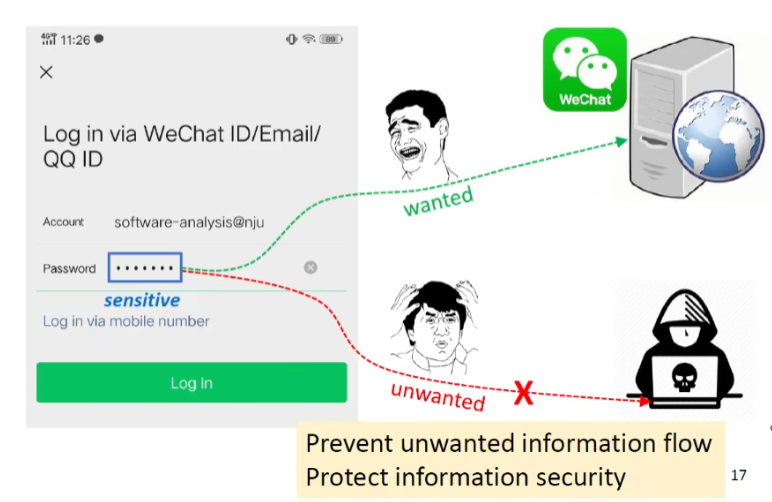

### Access Control vs. Information Flow Security

- Access control(a standard way to protect sensitive data)
  - Checks if the program has the rights/permissions to access certain information.
  - Concerns how information is accessed. [What happens after that?]
- Information flow security(end-to-end)]
  - Tracks how information flows through the program to make sure that the program handles the information securely
  - Concerns how information is propagated

### Information Flow*

Information flow: if the information in variable x is transferred to variable y, then there is information flow x => y

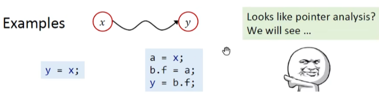

**Information Flow Security**

Connects information flow to security

- Classifies program variables into different security levels
- Specifies permissible flows between these levels, i.e., information flow policy

### Security Levels(Classes)

The most basic model is two-level policy, i.e., a variable is classified into one of two security levels:

- H, meaning high security, secret information
- L, meaning low security, public observable information

```solidity
h = getPassword(); // h is high security
broadcast(l); // l is low security
```


More Complicated Security Levels

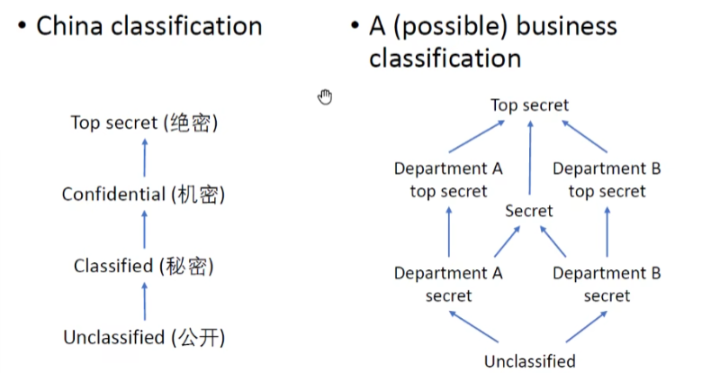

### Information Flow Policy

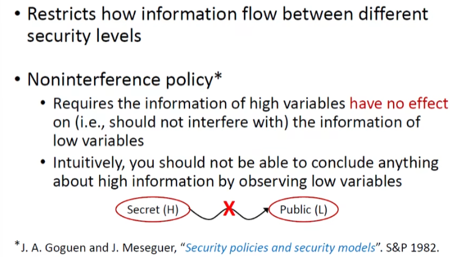

Noninterference

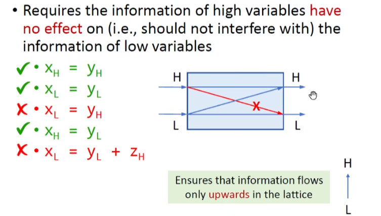

## Confidentiality and Integrity

### brief

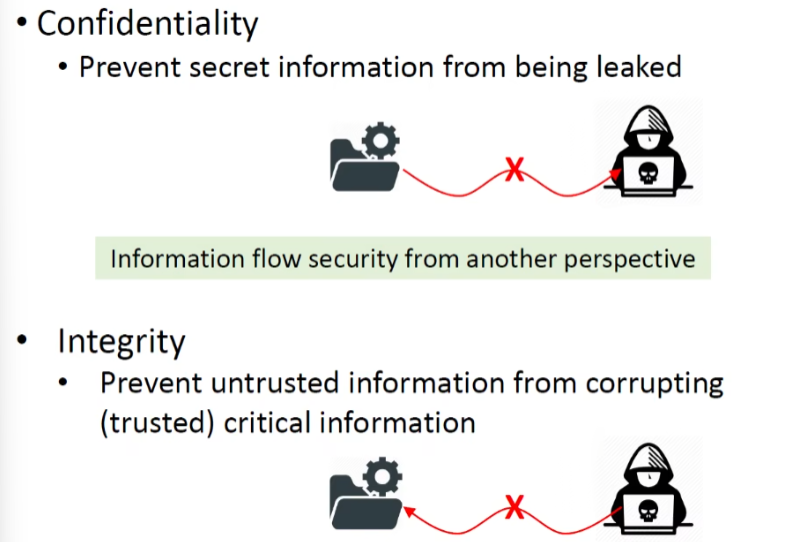

Integrity例子

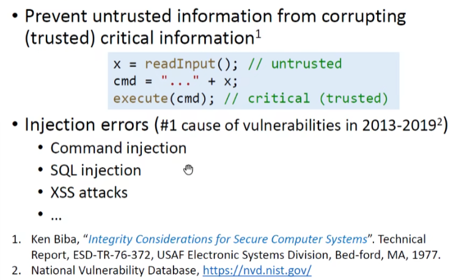

Confidentiality and Integrity

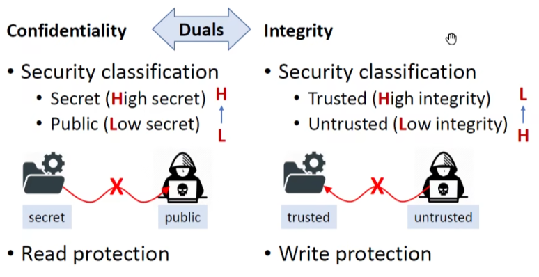

### Integrity, Broad Definition

- Maintenance and the assurance of the accuracy, completeness, and consistency of data
- Accuracy(正确性): E.g., for information flow integrity, the (trusted) critical data should not be corrupted by untrusted data
- Completeness(完整性): E.g., a database system should store all data completely
- Consistency(一致性): E.g., a file transfer system should ensure that the file contents of both ends(sender and receiver) are identical.

## Explicit Flows and Convert Channels

### How Does Information Flow

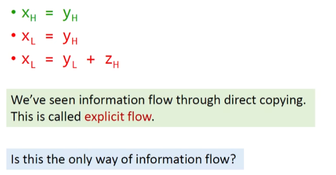

Does Secret Information Leak? Implicit Flows! 

> 通过控制流去泄露了隐私信息

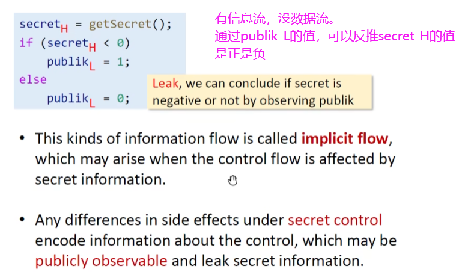

Are there any other kinds of information flows?

我们来看一个例子：

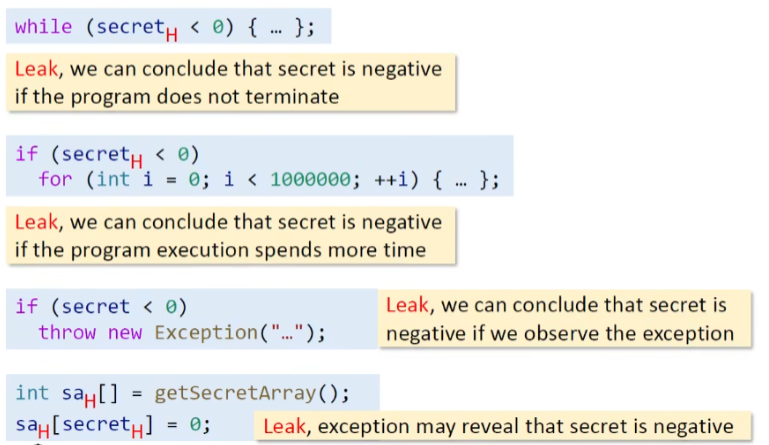

这些例子都叫做Convert/Hidden Channels

### Convert/Hidden Channels

> 本来你的程序不是想流出信息的，同时也没有流出数据，但是像上面那些例子，隐式地戏泄露出去了，就叫做隐藏信道

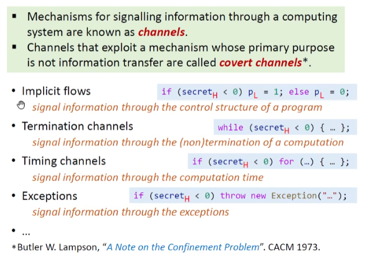

Explicit Flows and Covert Channels

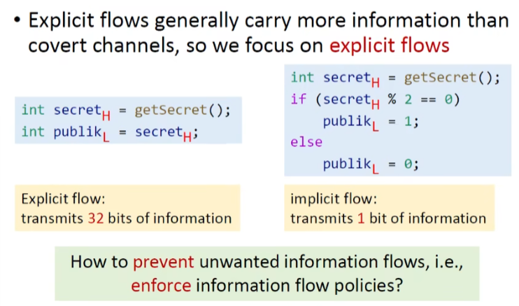

## Taint Analysis

### Brief

> 给数据打标签，而不是变量

- Taint analysis is the most common information flow analysis. It classifies program data into two kinds:
  - Data of interest, some kinds of labels are associated with the data, called tainted data
  - Other data, called untainted data
- Sources of tainted data is called sources. In practice, tainted data usually come from the return values of some methods(regarded as sources).
- Taint analysis tracks how tainted data flow through the program and observes if they can flow to locations of interest(called sinks). In practice, sinks are usually some sensitive methods.

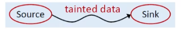

### Two Applications

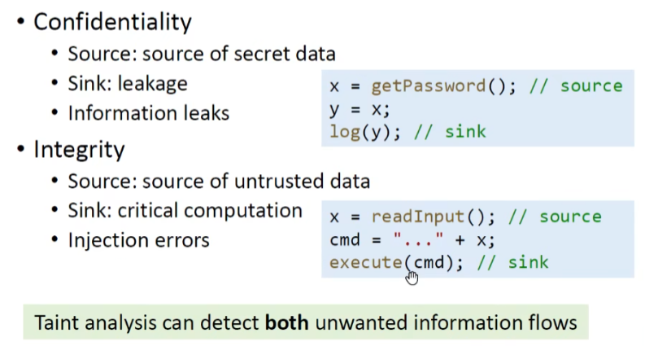

### Taint and Pointer Analysis, Together*

#### Brief

“Can tainted data flow to a sink?” Or in another way, "Which tainted data a pointer (at a sink) can point to?"

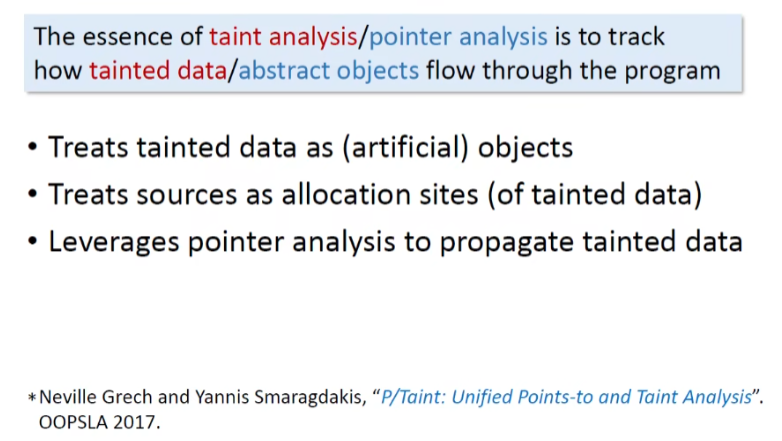

#### Domains and Notations

> 上下文不敏感为例，因为更简单，用于理解污点分析的核心思想
>
> 为了简单起见，我们将Taint data定义为方法敏感方法的返回值

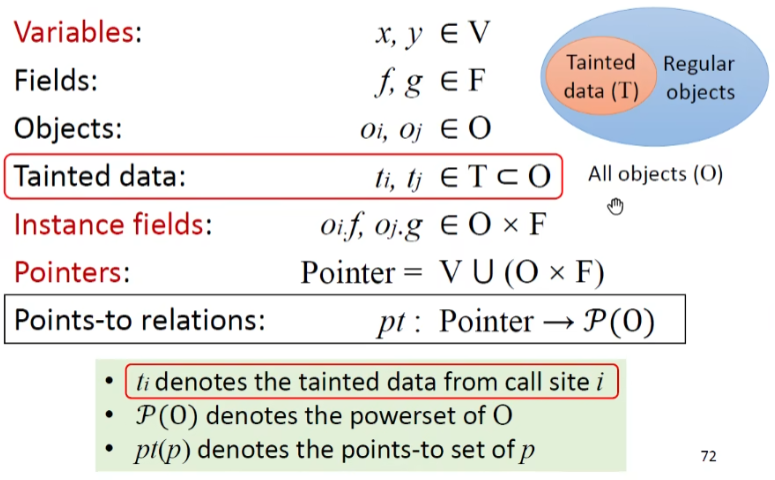

#### Inputs & Outputs

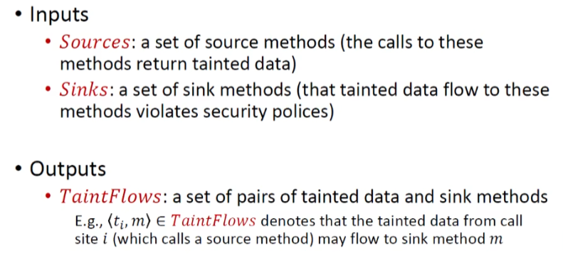

#### Rules

##### Call

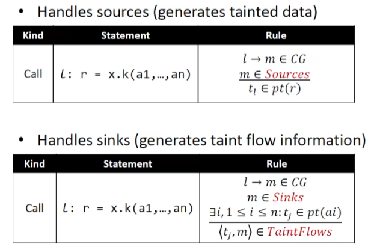

##### other

Same as Pointer Analysis

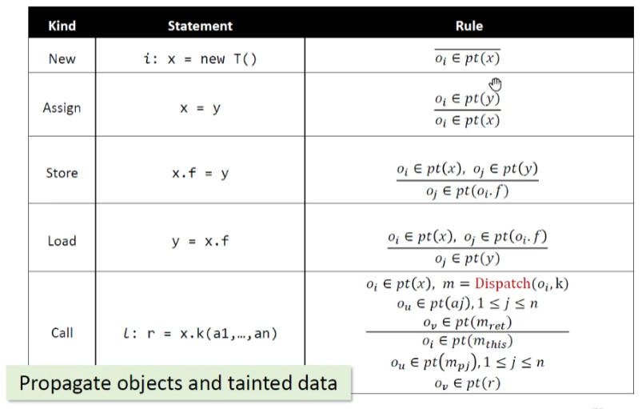

#### example

1

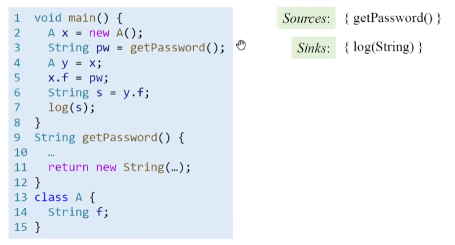

2

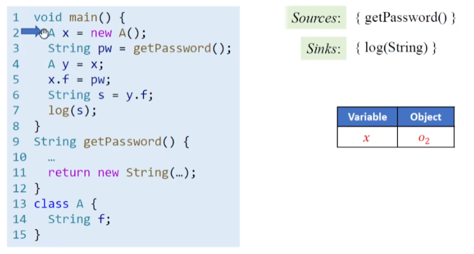

3

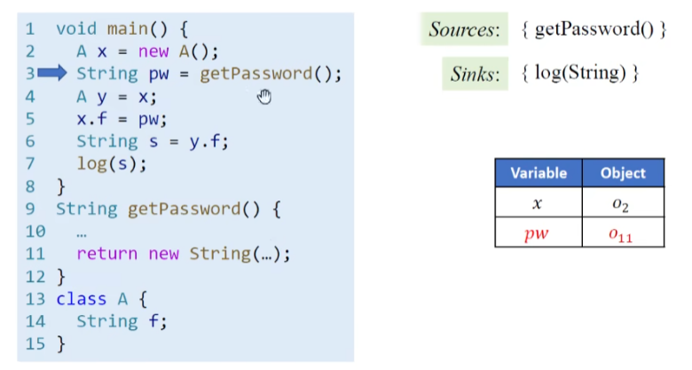

4

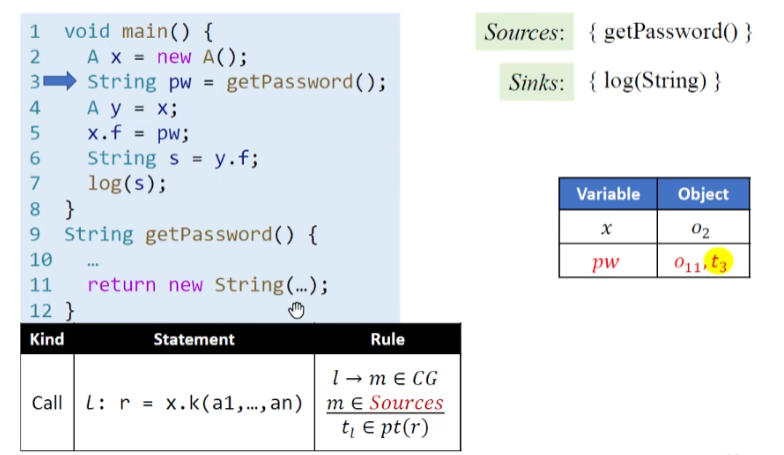

5

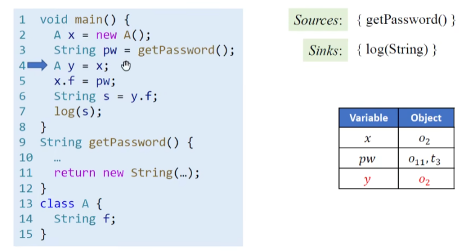

6

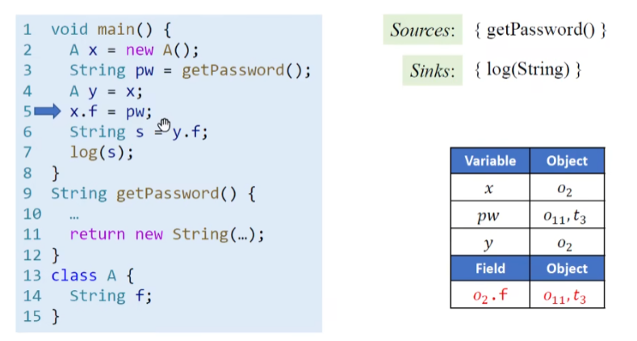

7

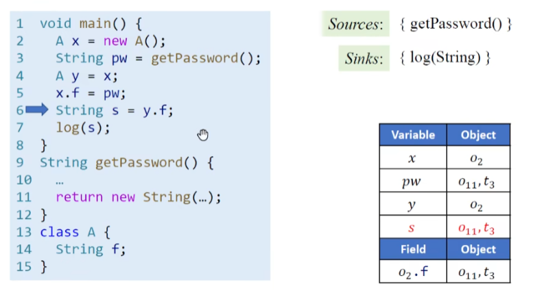

8

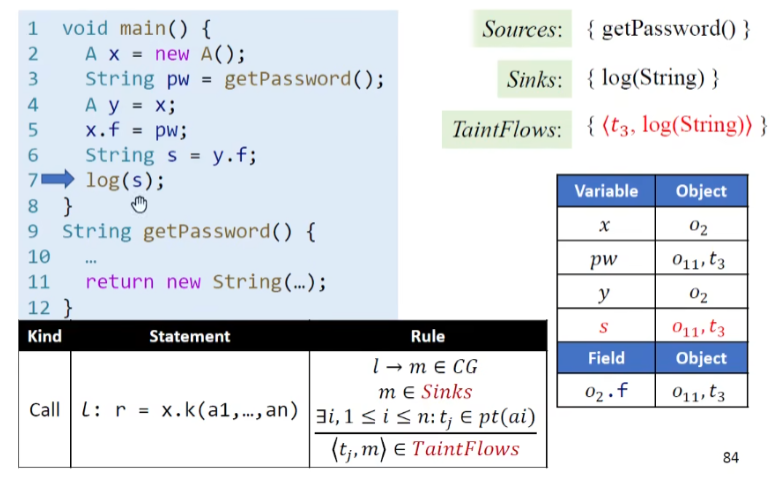

9：结束

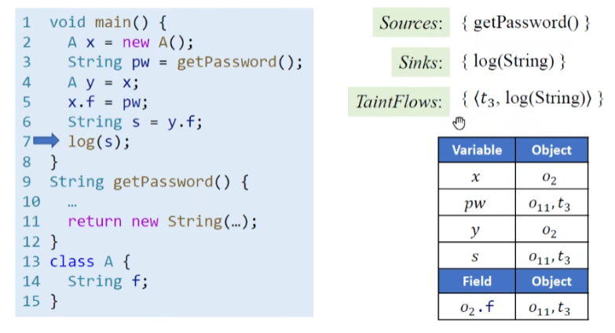

> 我觉得污点分析的Taint data就是搭着Pointer Analysis的便车，顺便检测出来


